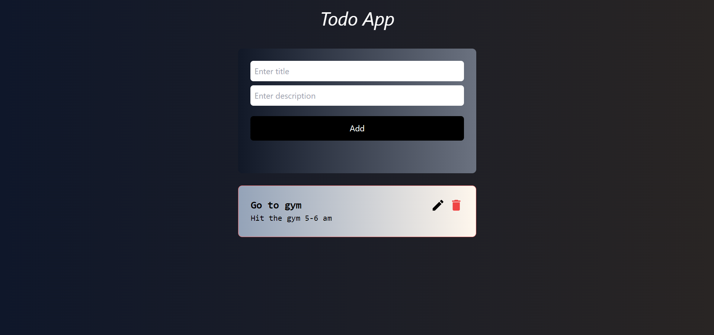

# Technologies Used
 
 * **Node.js**: Backend JavaScript runtime environment.
 * **Express.js**: Web application framework for Node.js.
 * **React.js**: Frontend Javascript Web application.
 * **MongoDB**: NoSQL database for storing URL mappings and statistics.
 * **Mongoose**: MongoDB object modeling for Node.js.
 * **Tailwindcss**: Tailwind CSS for responsive design.



## Features

* Create, Read, Update, and Delete todo items.
* Real-time updates for collaborative task management.
* Responsive design for optimal user experience across devices.


 # Installation
* Clone the repository:

```bash
git clone https://github.com/mauryavinay1407/full-stack-mern-todo.git
```

* Install server dependencies:
```bash
cd server
npm install
```

* Install client dependencies:
```bash
cd ..
cd client
npm install
```

* Configure environment variables:

Create a .env file in the root directory and define the following variables:

* Start the server:

```bash
cd server
npm start
```

* Start the client:

```bash
cd ..
cd client
npm run dev
```
